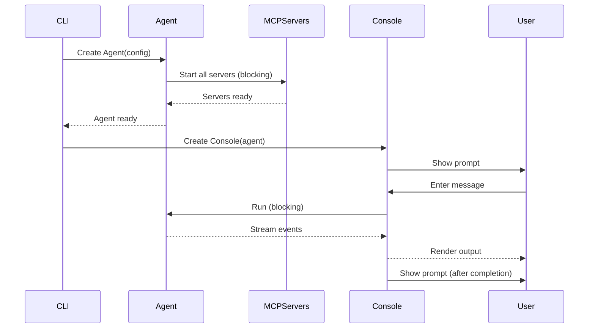
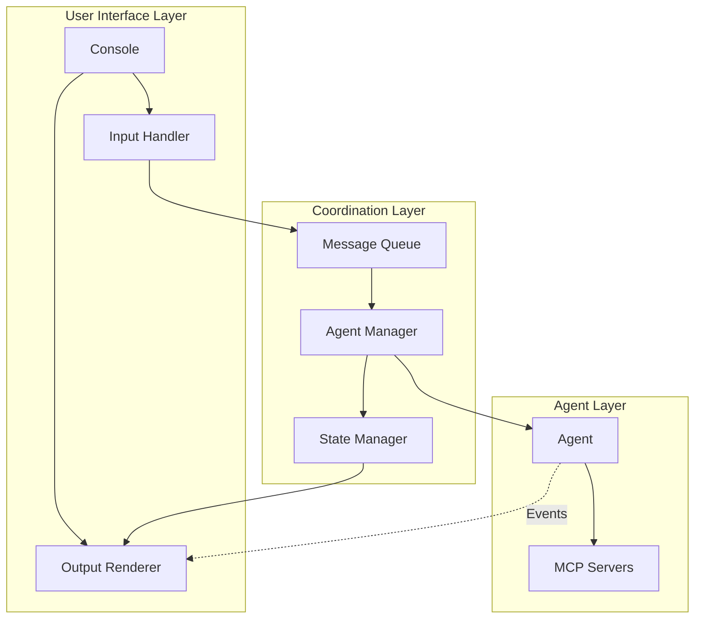

1 AgentController (new) Responsibility
• Kick off agent start-up (“cold start”) in the background as soon as it is constructed.
• Expose enqueue_prompt(str) and cancel_current().
• Maintain an asyncio.Queue of user prompts.
• Run a worker task that: – awaits agent start-up (if still warming) – feeds prompts to agent.run() – streams SDK events through an
asyncio.Queue (or async generator) = EventBus.
• Track the current job task so Esc can cancel it.
Public protocol (in psuedo-code): class AgentControllerProtocol(Protocol): async def start() -> None # kicks off warm-up def enqueue_prompt(text: str) -> None def
cancel_current() -> bool def events(self) -> AsyncIterator[AgentEvent] # read-only
Implementation details
• Uses asyncio.create_task(agent_startup())
• Stores current_job_task: Optional[asyncio.Task]
• Keeps slim – no UI code inside.

2 Console / UI (replace ReplConsole)
• PromptToolkit Application with three panes (as in ui-multi-claude prototype): 1. Live status panel (spinner, timer, token counters) 2. Scroll-back/ rich log (events rendered here) 3. Prompt line
• On app start: controller = AgentController(cfg) await controller.start() # returns immediately app.create_background_task(render_loop(controller))
• Render loop pulls events from controller.events() and updates: – live status line while job in progress – rich log when ToolCall / Reasoning / MessageOutput arrives
• Key bindings: Enter → controller.enqueue_prompt(text) Esc → controller.cancel_current() Ctrl-C → graceful shutdown (calls
controller.cancel_current() then app exit)

3 CLI entry point
• Still builds the RuntimeConfig.
• Builds AgentController instead of awaiting Agent.**aenter**.
• Passes controller to Console factory.

4 Inversion-of-control
• App layers talk only via protocols: – Console depends on AgentControllerProtocol – AgentController depends on AgentProtocol (already exists) – AgentProtocol uses RuntimeConfig but nothing above it.
• Factory functions already present in cli.py stay, but now create the controller instead of raw Agent.

