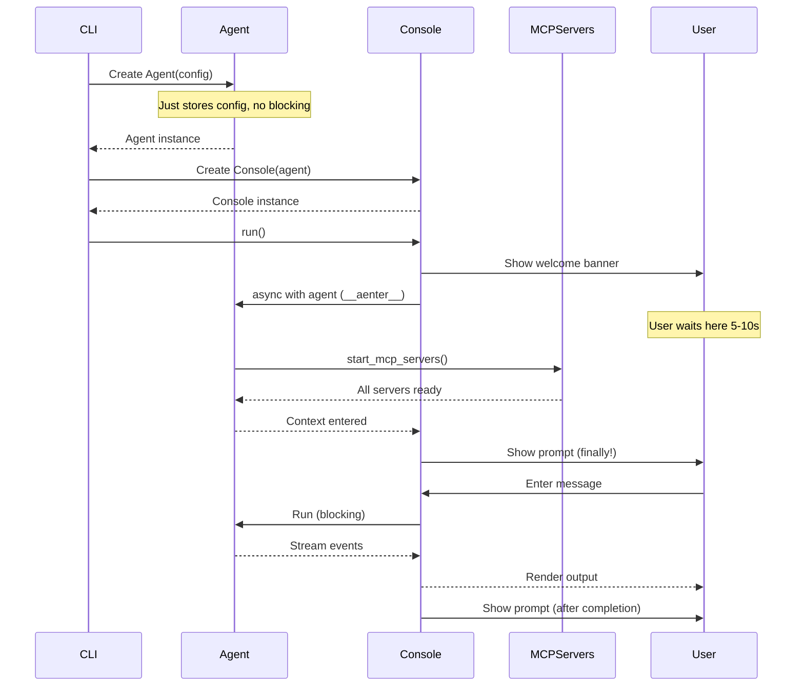
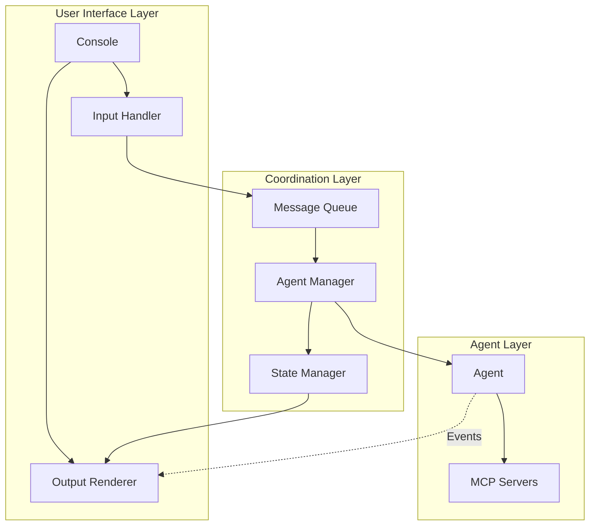
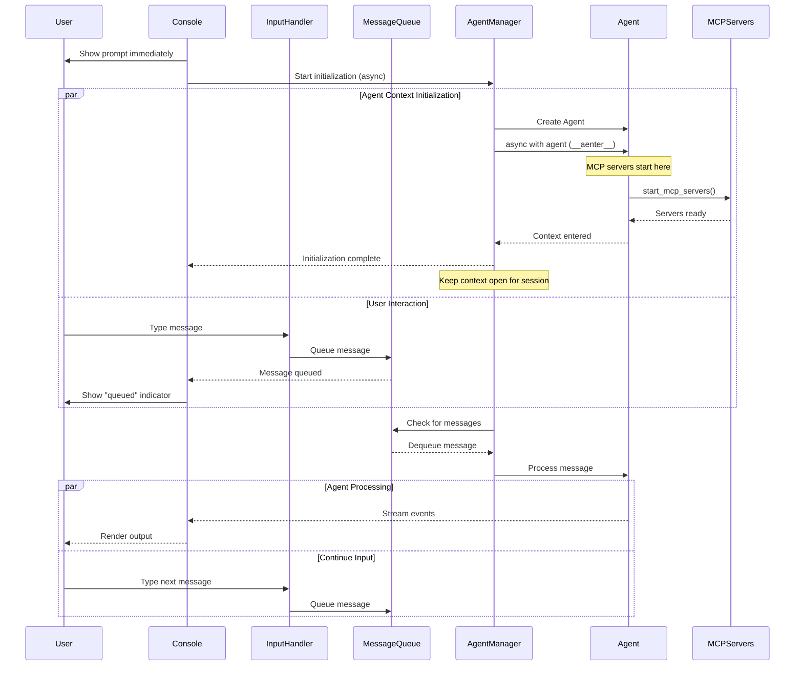
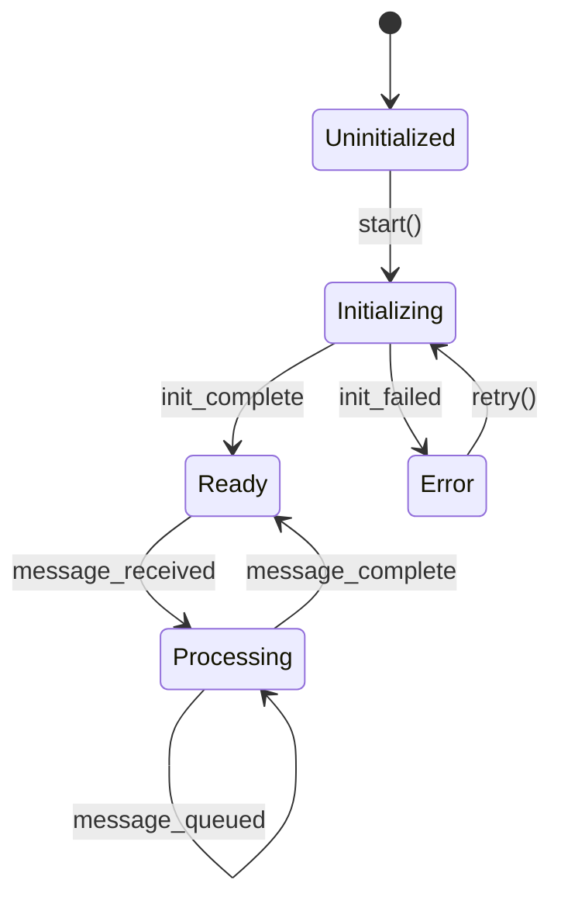

# Asynchronous Agent Architecture Design

## Executive Summary

This document outlines the architectural redesign of the OAI Coding Agent to improve responsiveness and user experience by:

1. **Non-blocking startup**: Prompting users immediately while agent initializes in background
2. **Non-blocking execution**: Allowing users to queue messages or cancel operations while agent is processing

## Current Architecture Analysis

### Current Flow



### Current Issues

1. **Context entry delay**: User waits 5-10s at `async with self.agent:` for MCP servers
2. **Blocking execution**: User cannot interact during agent processing
3. **Sequential flow**: Everything happens in order, no parallelism

## Proposed Architecture

### Core Design Principles

1. **Inversion of Control**: Console controls the flow, agent is a managed resource
2. **Message Queue Pattern**: Decouple user input from agent processing
3. **State Machine**: Clear states for agent lifecycle and message processing
4. **Event-Driven**: Components communicate through events, not direct calls

### High-Level Architecture



### Proposed Flow



**Key Insight**: The current implementation correctly uses an async context manager (`async with self.agent:`) to ensure proper resource management of MCP servers. Our proposed design maintains this pattern but moves the context entry to a background task, giving us the same safety with better UX.

## Key Components

### 1. Agent Manager

```python
class AgentManager(Protocol):
    """Manages agent lifecycle and message processing."""

    async def initialize(self) -> None:
        """Initialize agent in background."""

    async def process_messages(self) -> None:
        """Process queued messages."""

    async def cancel_current(self) -> None:
        """Cancel current message processing."""

    @property
    def state(self) -> AgentState:
        """Current agent state."""
```

### 2. Message Queue

```python
class Message:
    id: str
    content: str
    timestamp: datetime
    status: MessageStatus  # QUEUED, PROCESSING, COMPLETED, CANCELLED

class MessageQueue(Protocol):
    """Thread-safe message queue."""

    async def enqueue(self, content: str) -> Message:
        """Add message to queue."""

    async def dequeue(self) -> Optional[Message]:
        """Get next message to process."""

    async def peek(self) -> List[Message]:
        """View queued messages."""

    async def cancel(self, message_id: str) -> bool:
        """Cancel a queued message."""
```

### 3. State Manager

```python
class AgentState(Enum):
    UNINITIALIZED = "uninitialized"
    INITIALIZING = "initializing"
    READY = "ready"
    PROCESSING = "processing"
    ERROR = "error"

class StateManager(Protocol):
    """Manages application state."""

    @property
    def agent_state(self) -> AgentState:
        """Current agent state."""

    @property
    def current_message(self) -> Optional[Message]:
        """Currently processing message."""

    @property
    def queue_size(self) -> int:
        """Number of queued messages."""
```

### 4. Enhanced Console Interface

```python
class AsyncConsole(Protocol):
    """Non-blocking console interface."""

    def __init__(self, agent_manager: AgentManager):
        self.agent_manager = agent_manager
        self.message_queue = MessageQueue()

    async def run(self) -> None:
        """Main console loop."""
        # Start agent initialization in background
        # Start message processor in background
        # Handle user input immediately
```

## Key Design Patterns

### 1. Background Task Management



### 2. Event System

```python
class EventType(Enum):
    AGENT_INITIALIZING = "agent_initializing"
    AGENT_READY = "agent_ready"
    AGENT_ERROR = "agent_error"
    MESSAGE_QUEUED = "message_queued"
    MESSAGE_PROCESSING = "message_processing"
    MESSAGE_COMPLETED = "message_completed"
    MESSAGE_CANCELLED = "message_cancelled"

class Event:
    type: EventType
    payload: Dict[str, Any]
    timestamp: datetime
```

### 3. Cancellation Support

```python
class CancellationToken:
    """Token for cancelling operations."""

    def __init__(self):
        self._cancelled = False
        self._callbacks = []

    def cancel(self) -> None:
        """Cancel the operation."""
        self._cancelled = True
        for callback in self._callbacks:
            callback()

    @property
    def is_cancelled(self) -> bool:
        return self._cancelled
```

## Implementation Strategy

### Phase 1: Foundation

1. Implement `AgentManager` with background initialization
2. Create `MessageQueue` with async-safe operations
3. Add `StateManager` for tracking system state

### Phase 2: Console Enhancement

1. Refactor `ReplConsole` to use `AgentManager`
2. Implement non-blocking prompt with status indicators
3. Add keyboard shortcuts (ESC to cancel, etc.)

### Phase 3: Advanced Features

1. Message history and replay
2. Priority queue for messages
3. Progress indicators for long operations

## Benefits

1. **Improved Responsiveness**: Users see prompt immediately
2. **Better UX**: Can queue messages or cancel operations
3. **Clean Architecture**: Clear separation of concerns
4. **Extensibility**: Easy to add new features like message history
5. **Testability**: Components can be tested independently

## Migration Path

1. Create new `AsyncConsole` alongside existing `ReplConsole`
2. Implement `AgentManager` as wrapper around existing `Agent`
3. Gradually migrate features to new architecture
4. Switch default console once stable
5. Deprecate old console implementation

## Example User Experience

```
$ oai-coding-agent
╭─ OAI CODING AGENT ─╮
[Initializing agent... (ESC to cancel)]

› Hello, can you help me?
[Message queued - agent initializing...]

[Agent ready!]
[Processing: "Hello, can you help me?"]

Agent: Hello! I'd be happy to help...

› [Currently processing... ESC to cancel, or type to queue next message]
```
