# Complete Sequence Flow

## End-to-End User Journey

This diagram shows the complete flow from startup through multiple operations with the new architecture.

```mermaid
sequenceDiagram
    participant User
    participant CLI
    participant Console
    participant StatusPanel
    participant Orchestrator
    participant JobQueue
    participant Agent
    participant MCPServers
    participant ScrollbackArea
    participant AnimationLoop

    %% Startup Phase
    User->>CLI: oai-coding-agent
    CLI->>Orchestrator: Create AgentOrchestrator
    Note over Orchestrator: Just stores config
    CLI->>Console: Create EnhancedConsole(orchestrator)
    Console->>StatusPanel: Initialize
    Console->>JobQueue: Create
    Console->>AnimationLoop: Start (10 FPS)

    Console->>User: Show prompt immediately
    StatusPanel->>StatusPanel: "🟡 Initializing..."

    %% Parallel initialization
    par Agent Context Initialization
        Console->>Orchestrator: initialize() [async task]
        Orchestrator->>Agent: Create Agent instance
        Orchestrator->>Agent: async with agent (__aenter__)
        Note over Agent: This is where MCP servers start
        Agent->>MCPServers: start_mcp_servers()
        Orchestrator->>StatusPanel: Progress: 30%
        MCPServers-->>Agent: Filesystem server ready
        Orchestrator->>StatusPanel: Progress: 60%
        MCPServers-->>Agent: Git server ready
        Orchestrator->>StatusPanel: Progress: 90%
        MCPServers-->>Agent: All servers ready
        Agent-->>Orchestrator: Context entered successfully
        Orchestrator->>StatusPanel: "🟢 Ready"
    and User Types First Message
        User->>Console: "Help me refactor main.py"
        Console->>JobQueue: Enqueue message
        JobQueue->>StatusPanel: "Queue: 1 pending"
        Console->>User: "Message queued (#a4f2)"
    and Animation Updates
        loop Every 100ms
            AnimationLoop->>StatusPanel: Update animations
            StatusPanel->>StatusPanel: Update spinner frame
            StatusPanel->>StatusPanel: Update timer
            StatusPanel->>StatusPanel: Ease token counts
        end
    end

    %% Processing First Message
    Note over Orchestrator: Agent context now ready
    Orchestrator->>JobQueue: Dequeue
    JobQueue-->>Orchestrator: "Help me refactor main.py"
    Orchestrator->>StatusPanel: "🔵 Processing request"
    StatusPanel->>StatusPanel: Start timer

    Orchestrator->>Agent: Process message
    Agent->>ScrollbackArea: "🤔 Agent Thinking"
    Agent->>ScrollbackArea: "I need to help with: refactor main.py"

    %% Tool Calls
    Agent->>StatusPanel: "📖 read_file"
    StatusPanel->>StatusPanel: "file: /src/main.py"
    Agent->>MCPServers: Read file
    MCPServers-->>Agent: File content
    Agent->>ScrollbackArea: "📖 read_file\n├─ file: /src/main.py"
    Agent->>ScrollbackArea: "📄 Read 145 lines (0.8s)"
    Agent->>StatusPanel: Add tokens: +145, +42

    %% User queues another message
    User->>Console: "Also check the tests"
    Console->>JobQueue: Enqueue message
    JobQueue->>StatusPanel: "Queue: 1 pending"

    %% More tool calls
    Agent->>StatusPanel: "✏️ edit_file"
    StatusPanel->>StatusPanel: "lines: 23-31 | Queue: 1"
    Agent->>MCPServers: Edit file

    %% User cancels
    User->>Console: [ESC]
    Console->>Orchestrator: Cancel current
    Orchestrator->>Agent: Cancel
    Agent->>StatusPanel: "❌ Cancelled"
    Agent->>ScrollbackArea: "🚫 Job cancelled by user"

    %% Process queued message
    Orchestrator->>JobQueue: Dequeue
    JobQueue-->>Orchestrator: "Also check the tests"
    Orchestrator->>StatusPanel: "🔵 Processing request"
    JobQueue->>StatusPanel: "Queue: 0"

    %% Continue with next job...
```



## State Transitions Throughout Flow


## Component Interaction Patterns

### 1. Status Updates Flow

```
Event Source → Event Broker → Status Panel → Animation Loop → UI Update
     ↓                            ↓
Tool calls                   Update text
Token counts                Update animations
Progress                    Trigger redraw
```

### 2. Message Flow

```
User Input → Job Queue → Orchestrator → Agent → Events
                ↓                         ↓
           Queue Status              Tool Calls
                                    Token Updates
                                    Results
```

### 3. Animation Flow

```
Animation Loop (10 FPS)
    ├─→ Token Counter → Ease values → Update display
    ├─→ Timer → Update elapsed → Update display
    └─→ Spinner → Next frame → Update display
```

## Key Timing Characteristics

| Operation           | Duration | User Experience         |
| ------------------- | -------- | ----------------------- |
| Show initial prompt | <50ms    | Instant                 |
| Queue message       | <10ms    | Instant feedback        |
| Start processing    | <100ms   | Immediate status change |
| Cancel operation    | <500ms   | Quick response          |
| Animation frame     | 100ms    | Smooth 10 FPS           |
| Token easing        | ~1s      | Natural animation       |

## Concurrency Model

```python
# Main async tasks running concurrently
async def run(self):
    await asyncio.gather(
        # User-facing tasks
        self.prompt_loop(),          # Always responsive
        self.animation_loop(),       # 10 FPS updates

        # Background tasks
        self.orchestrator.initialize(),   # One-time startup
        self.job_processor.run(),         # Process queue
        self.event_router.run(),          # Route events

        # Graceful shutdown on exit
        return_exceptions=True
    )
```

This complete flow demonstrates how all components work together to create a fluid, responsive experience where:

- Users never wait for initialization
- All operations can be cancelled
- Status is always visible and animated
- Multiple messages can be queued
- The UI remains responsive throughout
