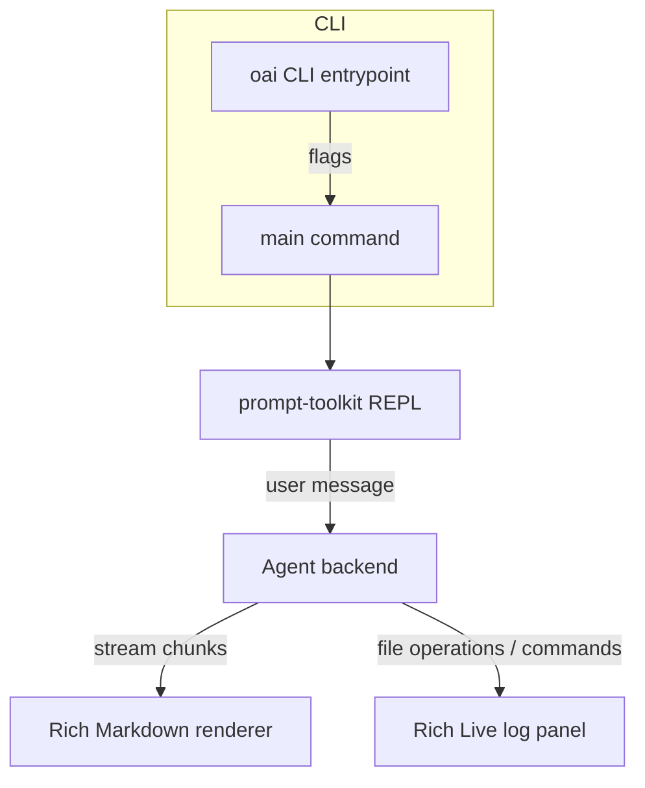

# CLI Usage

Full reference for the `oai` command:

```bash
$ oai --help
Usage: oai [OPTIONS]

  OAI CODING AGENT - starts an interactive or batch session

Options:
  --openai-api-key TEXT           OpenAI API key  [env var: OPENAI_API_KEY; required]
  -m, --model [codex-mini-latest|o3|o4-mini]
                                  OpenAI model to use  [default: codex-mini-latest]
  --mode [default|async|plan]     Agent mode: default, async, or plan  [default: default]
  --repo-path PATH                Path to the repository. This path (and its
                                  subdirectories) are the only files the agent
                                  has permission to access
  -p, --prompt TEXT               Prompt to run in non-interactive mode
  --install-completion            Install completion for the current shell.
  --show-completion               Show completion for the current shell, to
                                  copy it or customize the installation.
  --help                          Show this message and exit.
```


