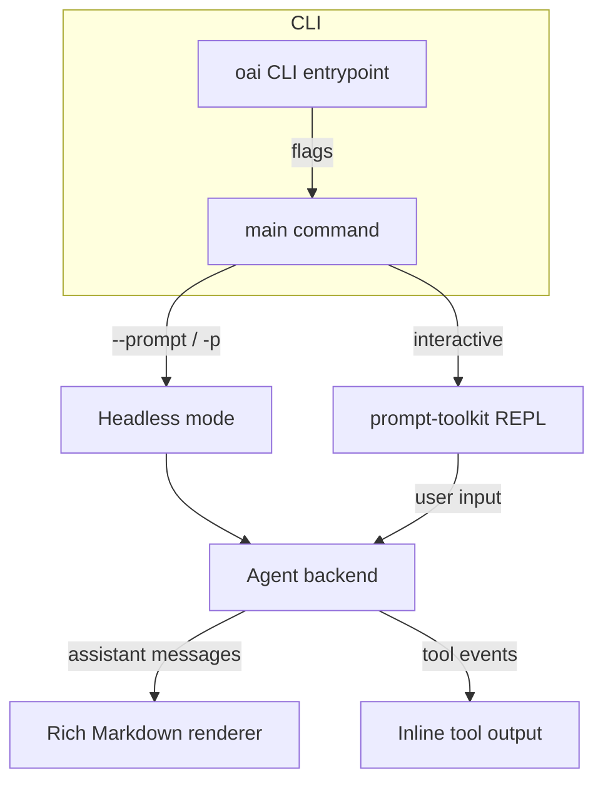

```mermaid
flowchart TD
  subgraph CLI
    A[oai CLI entrypoint] -->|flags| B[main command]
  end
  B -->|--prompt / -p| H[Headless mode]
  B -->|interactive| C[prompt-toolkit REPL]
  H --> D[Agent backend]
  C -->|user input| D
  D -->|assistant messages| E[Rich Markdown renderer]
  D -->|tool events| F[Inline tool output]
```