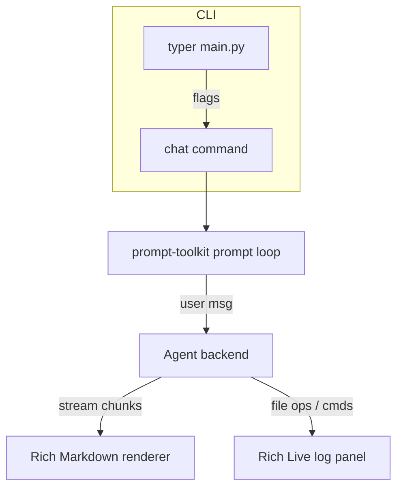

```mermaid
flowchart TD
  subgraph CLI
    A[typer main.py] -->|flags| B[chat command]
  end
  B --> C[prompt-toolkit prompt loop]
  C -->|user msg| D[Agent backend]
  D -->|stream chunks| E[Rich Markdown renderer]
  D -->|file ops / cmds| F[Rich Live log panel]
```
