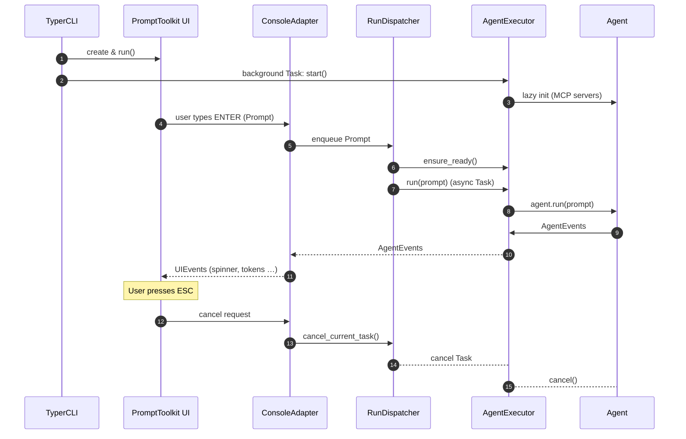

# OAI Coding Agent – CLI Refactor Design

> Status: Draft (2025-06-19)  
> Authors: OAI pair-programming session  
> Scope: CLI / Console code path only – no network or core-LLM changes

---

## 1 – Objectives

| ID | Goal |
|----|------|
| G1 | Show the prompt immediately; start the Agent in the background. |
| G2 | After a prompt is submitted, keep the UI responsive: user can (a) enter another prompt which is queued (FIFO) or (b) press ESC to cancel the current run. |
| G3 | Replace the existing textual UI with the richer status panel prototyped in `ui-multi-claude.py`. |
| G4 | Keep the design simple and aligned with Clean Architecture / IoC; no over-engineering. |

---

## 2 – Component Model (Clean Architecture layers)

```
UI  (prompt_toolkit)
│
├─ PromptRenderer     – reads UIEvents & redraws LiveStatus
└─ KeyHandler         – marshals keys to actions
     │
     ▼
ConsoleAdapter
     • pushes Prompt objects to PromptQueue
     • converts AgentEvents → UIEvents
     │
     ▼
RunDispatcher                 (was: JobQueue + JobDispatcher)
     • FIFO queue of Prompt
     • launches AgentExecutor.run(prompt) as background Tasks
     • holds cancel handle for ESC
     │
     ▼
AgentExecutor                 (was: AgentManager)
     • lazily instantiates Agent via factory
     • `async with agent:` kept open until app exit
     • exposes `run(prompt) -> AsyncGenerator[AgentEvent]`
```

Terminology updates:

* **AgentExecutor** (preferred over “Manager”)
* **RunDispatcher** (instead of JobDispatcher)
* **PromptQueue**, **UIEventBus**, **AgentEventBus** retained

---

## 3 – Start-Up & Runtime Flow



Key timing: UI is visible immediately; Agent is still warming when the first prompt arrives but the dispatcher simply awaits `ensure_ready()` while the user sees a spinner.

---

## 4 – Detailed Responsibilities

### 4.1 AgentExecutor  
* Owns the single `Agent` instance.  
* Starts it once (`async with`) and keeps it alive.  
* `ensure_ready()` awaits startup completion.  
* `run(prompt)` forwards to `Agent.run()` and yields the event stream.

### 4.2 RunDispatcher  
* Holds `prompt_queue: asyncio.Queue[str]`.  
* Background coroutine loop:  
  1. `prompt = await prompt_queue.get()`  
  2. `current = asyncio.create_task(executor.run(prompt))`  
  3. Relay events to ConsoleAdapter.  
  4. On `Cancel`, call `current.cancel()`.  
* FIFO only, no parallelism.

### 4.3 ConsoleAdapter  
* Bridges UI ↔ domain events.  
* Converts key-bindings into queue operations.  
* Maps `AgentEvent` → `UIEvent` (existing mapper reused).  
* No business logic here.

### 4.4 PromptToolkit UI  
* Derived from `ui-multi-claude.py`.  
* Areas:  
  1. Scroll-back log (Rich)  
  2. LiveStatus panel (spinner, timer, tokens)  
  3. Prompt line  
* Hotkeys: `Enter` (submit), `ESC` (cancel run), `Ctrl-C` (quit).

---

## 5 – Public APIs / IoC Hooks

```python
# factories reused from cli.py
_agent_factory: Callable[[RuntimeConfig], AgentProtocol]
_console_factory: Callable[[AgentProtocol], ConsoleInterface]

# NEW
_run_dispatcher_factory: Callable[[AgentExecutor], RunDispatcher] | None = None
```

These keep the CLI decoupled from concrete implementations.

---

## 6 – Error & Cancellation Semantics

* Cancelling the **current** run only.  
* If nothing is running, ESC does nothing (UI flashes message).  
* Agent cancellation relies on `asyncio.CancelledError` bubbling from task.  
* If AgentExecutor startup fails, ConsoleAdapter displays fatal error and exits.

---

## 7 – User Interaction Cheatsheet

| Keys          | Action                              |
|---------------|-------------------------------------|
| `Enter`       | Submit prompt (queued FIFO)         |
| `ESC`         | Cancel current run (if any)         |
| `Ctrl-C`      | Clean shutdown (closes MCP, etc.)   |

---

## 8 – Future-proofing / Out-of-Scope

* Persisting prompt history is already handled (`get_data_dir`).  
* Parallel Agent runs or multiple Agents – postpone.  
* GUI / TUI split – postpone.

---

## 9 – Implementation Roadmap (incremental)

1. Scaffold `agent_runtime.py` containing `AgentExecutor`.  
2. Extract JobQueue/Status logic from `ui-multi-claude.py` into `run_dispatcher.py`.  
3. Replace `ReplConsole.run()` with new PromptToolkit-driven loop using ConsoleAdapter.  
4. Wire everything in `cli.create_app()` (background startup).  
5. Unit-test cancellation & queuing behaviour.  
6. Remove now-unused blocking REPL code.

---

## 10 – Glossary

* **Prompt** – raw user input string.  
* **AgentEvent** – domain event emitted by `Agent.run()`.  
* **UIEvent** – rendering instruction for PromptToolkit UI.  
* **Run** – a single invocation of `Agent.run(prompt)`.
